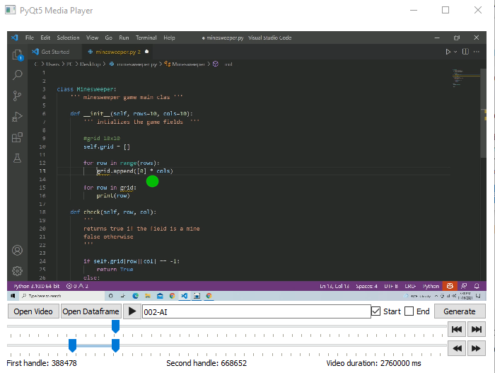
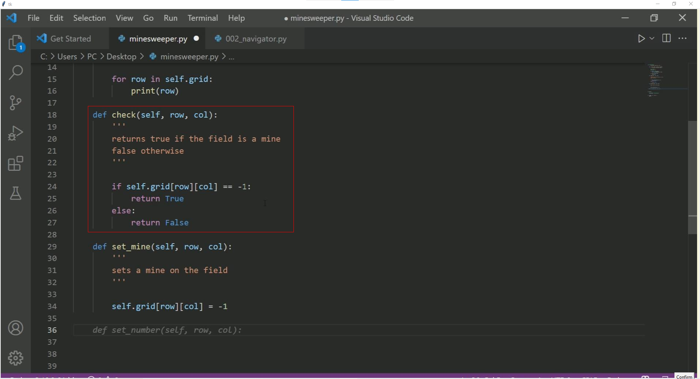

# Project Name
> Will add description later

## Table of Contents
* [Technologies Used](#technologies-used)
* [Features](#features)
* [Usage](#usage)
* [Setup](#setup)
* [File Descriptions](#file-descriptions)
* [Requirements](#requirements)

## Technologies Used
This project is created with
- PyQt5
- tkinter


## Features
- Visualizing fixation over the experiment screen recording
- Slicing the video to analyze the eyetracking data 
- Selecting the area of interest (AOI) through drawing a rectangle using a mouse

## Usage
### Media Player

- Choose a video and the dataframe by clicking the button "Open Video" and "Open Dataframe". The play video button should be enabled once both of these were selected.
- Select a slice using the second slidebar with two handles. The left handle indicate the start slice and the right handle indicate the end of the slice.

  <details>
    <summary>More on how to select a slice</summary>

    ### How to select a slice?
    - We generally want to make a slice whenever any of the following event happens: scrolls in the screen, addition of code, deletion of code and modification of existing code.
      - ##### Scrolls in the screen
        - Start frame: After the last scroll
        - End frame: Right before the scroll
        - Screenshot: End frame
        - AOI: Lines of code that was modified in the slice
      - ##### Addition
        - Start frame: Right before the addition
        - End frame: Right after the addition
        - Screenshot: End frame
        - AOI: Lines of code that was added
      - ##### Deletion
        - Start frame: Right before the deletion
        - End frame: Right after the deletion
        - Screenshot: Start frame
        - AOI: Lines of code that was removed
      - ##### Modification of existing code
        - A new slice has to be made for a modification of an existing code because it leads to a change in coordinate values of the tokens
        - Start frame: Right before the modification
        - End frame: Right after the modification
        - Screenshot: End frame (Start frame if a code was deleted)
        - AOI: Lines of code that was modified
  </details>

- Enter the participant number and the trial type (AI, Driver, Navigator) in a textbox with a following format: "001-AI".
- Select the checkbox indicating which frame you want to take the screenshot of.
- Click the generate button to create a slice.

### Selecting the area of interest (AOI) with a popup window

- The popup window will be shown once you were able to generate a slice correctly.
- Use a mouse to create a rectangle of AOI and click the confirm button at the bottom right of the screen.
- The window will close automatically after you click the button.

## Setup
Folder setup: make sure to prepare a "Data" folder in a parent directory to keep the generated screenshots and csv files.
```
├── Data
└── Code
    └── read.py
    └── player.py
    └── draw_box.py
    └── emip_toolkit.py
└── Results
    └── 001
      └── Video
            └── screenrecording
      └── df.csv
    └── 002
    └── ...
```

## File Descriptions
### read.py
- Read asc file from Eye Link 1000 eye tracker and write a result in a csv file
### player.py
- Code for running the video player
### draw_box.py
- Code for drawing a rectangle over tkinker popup window
### emip_toolkit.py
- Collection of functions that help with the analysis of eyetracking data
  - vscode_find_aoi()
    - Find Area of Interest in a given vscode screenshot image and store the aoi attributes in a Pandas Dataframe
  - vscode_draw_aoi()
    - Draws AOI rectangles on to an image
  - crop_image()
    - Crops an image with a given left, top, right, bottom corners
  - image_to_text()
    - Converts an image to text
  - add_token()
    - Adds tokens to aois dataframe and returns it
  - gather_fixations()
    - Gathers fixations from a dataframe
  - fixation_offset()
    - Adds offset to fixations
  - draw_fixation()
    - Draw fixations on an image
  - hit_test()
    - Match fixations to AOIs to calculate the fixation duration over each AOI

## Requirements
numpy, pandas, matplotlib, PyQt5, Pillow, pytesseract, QtRangeSlider, opencv
